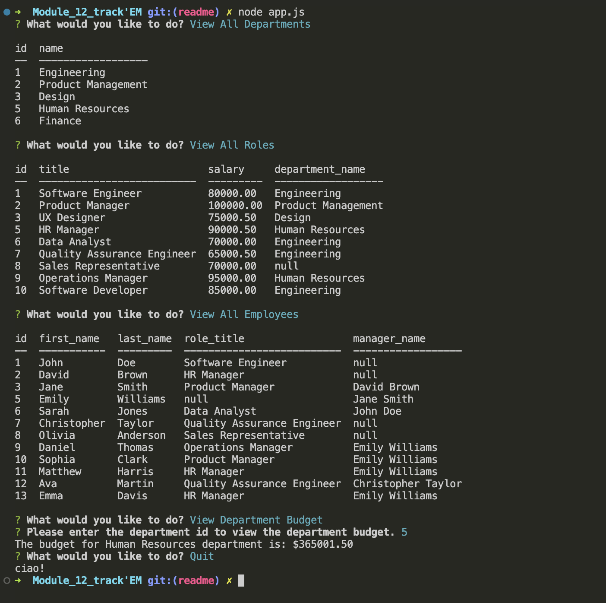

# track'EM : employee tracker

## Description

track'EM is a comprehensive employee tracking system designed to simplify the task of monitoring and managing employees. It offers a range of functionalities across three main categories: departments, roles, and employees. In addition to the standard features of viewing, adding, updating, and deleting records, track'EM provides various flexible viewing options for employees. With track'EM, users can easily access and analyze employee data based on different criteria. Moreover, the system offers an insightful overview of salary budgets by calculating the total salaries of employees within each department. This allows organizations to gain a better understanding of their expenditure and make informed decisions. With its user-friendly interface and powerful capabilities, track'EM streamlines the process of tracking and managing employees efficiently.

## Table of Contents

- [Installation](#installation)
- [Usage](#usage)
- [Contributing](#contributing)
- [Tests](#tests)
- [License](#license)
- [Questions](#questions)

## Installation

1. Clone or download the repository to your device.
2. Install node.js v18.15.0
3. Install the necessary package: console.table@0.10.0, dotenv@16.1.3, express@4.18.2, inquirer@8.2.4, mysql2@3.3.3

## Usage

1. Run the application by typing "node app.js" in Terminal (Mac users) or PowerShell (Windows users).
2. Use the up and down arrow keys to scroll through the options of the prompt.
3. Press the return key to select a desired option, and provide the necessary information when prompted.
4. To exit the application, choose the "Quit" option from the menu.

Please find attached demo videos showcasing the functionality of our application. 
https://drive.google.com/file/d/1aoQ3zd8vijoPqUMiVG9nQm5GYGV6M0jf/view  

## License

This project is licensed under the MIT License - see the link for detail
https://opensource.org/license/mit/

## Credits

OpenAI 
License Badge created by shields.io 
License links provide by opensource.org 

## Tests

Currently, there is no test available.

- My GitHub: jenryt
- My email: bicodeture@gmail.com
